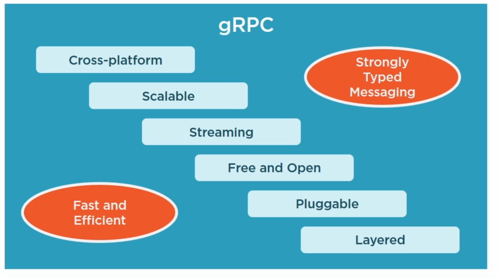
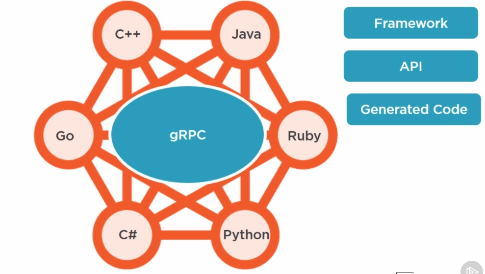

# gRPC
* http://www.grpc.io
* [Performance Comparison](https://performance-dot-grpc-testing.appspot.com/explore?dashboard=5760820306771968)
* Moving beyond JSON and XML with Protocol Buffers pluralsight course

## Installing
1. [Protocol Buffers Download Latest Version](https://github.com/google/protobuf/releases)
2. Add to Windows Environment path
3. run
```
protoc --version
```
4. Nuget install Grpc.Tools
5. Nuget Grpc
6. Nuget Google.ProtoBuf
7. [Creates certs](http://stackoverflow.com/a/37739265)

## REST

* Resource Focus
* Embrace HTTP Semantics
* Loose Coupling
* Messaging often text based

## RPC

* Action Focus
* Embrace Programming Semantics
* Tighter Coupling
* Handles Serialization
* Message often binary based

## Goals

* Cross-platform
* Scalable
* Streaming
* Bi-Directional 
* Free and Open
* Pluggable
* Layered
* Fast and Efficient
* Strongly Typed Messaging
* Generated Code
* Serves a different purpose to event bus. 





## Generate Code for C#
```
protoc -I \src\pb --csharp_out \src\Gprc\messages \src\pb\messages.proto --grpc_out \src\Grpc\messages --plugin=protoc-gen-grpc=\src\Gprc\packages\Grpc.Tools.1.0.1\tools\windows_x64\grpc_csharp_plugin.exe
```

## Design Cycle
1. Define Messages
2. Generate Source Code
3. Write Client/Server

## Authentication
1. Insecure (HTTP/1)
2. SSL/TLS (HTTP/2)
3. Google Token-based (Must be SSL)
4. Custom (OAuth2)

## Protocol Buffer Example

* option langauge_package overwrites package above it when generating code.
* = x is the param  number.

```
syntax = "proto3";

package user;

option go_package = "grpcdemo/pb";
option csharp_namespace = "Messages";

message HelloRequest {
	string Name = 1;
}

message HelloResponse {
	string Message = 1;
}

service HelloService {
	rpc SayHello (HelloRequest) returns (HelloResponse) {}
}
```

## Message Data Types
1. int32
2. int64 (DateTime)
3. string
4. float
5. bool
6. repated 

## Message Types
1. Unary (Request/Response)
2. Server Streaming
3. Client Streaming
4. Bidirectional Streaming

### Unary (Request/Response)
```
rpc Method(RequestType) returns (ResponseType) {}
```

### Server Streaming (Videos)
```
rpc Method(RequestType) returns (stream  ResponseType) {}
```

### Client Streaming (Upload)
```
rpc Method(stream RequestType) returns (ResponseType) {}
```

### Bidirectional Streaming (Upload & Download)
```
rpc Method(stream RequestType) returns (stream ResponseType) {}
```

## C# Server
* Can write EntityRepositoryRpc : IRepository which maps from Rpc Model to Application Model.

```
public class Program
{
	public static void Main(string[] args)
	{
		const int Port = 9000;
		var cacert = File.ReadAllText(@"ca.crt");
		var cert = File.ReadAllText(@"server.crt");
		var key = File.ReadAllText(@"server.key");
		
		var keypair =  new KeyCertificatePair(cert, key);
		var sslCredentials = new SslServerCredentials(new List<KeyCertificatePair>()
		{
			keypair
		}, cacert, false);
		
		Server server = new Server
		{
			Ports = { new ServerPort("0.0.0.0", Port, sslCredentials)},
			Services = {BindService(new EmployeeService())}
		};
		
		server.Start();
		
		Console.Writeline("Starting server on port " + Port);
		Console.WriteLine("Press any key to stop...");
		Console.ReadKey();
		
		server.ShutdownAsync().Wait();
	}
	
	public class EmployeeService: EmployeeServiceBase
	{
		//Metadata + Unary
		public override Task<EmployeeResponse> GetByBadgeNumber(GetByBadeNumberRequest request, ServerCallContext context)
		{
			Metadata md = context.RequestHeaders;
			foreach(var entry in md)
			{
				Console.WriteLine(entry.Key + ": " + entry.Value);
			}
			
			var emps = new List<Employee>(){
			{
				new Employee()
			}
			
			foreach(var e in emps)
			{
				if(request.BadgeNumber == e.BadgeNumber)
				{
					return new EmployeeResponse()
					{
						Employee = e;
					};
				}
			}
			
			throw new Exception("Employee not found with Badge Number: " + request.BadgeNumber);
		}
		
		//Server Streaming
		public override async Task GetAll(GetAllRequest request, IServerStreamWriter<EmployeeResponse> responseStream, ServerCallContext context)
		{
			var emps = new List<Employee>(){
			{
				new Employee()
			}
			
			foreach(var e in emps)
			{
				await responseStream.WriteAsync(new EmployeeResponse()
					{
						Employee = e;
					}); 
			}
		}
		
		//Client Streaming
		public override async Task<AddPhotoResponse> AddPhoto(IAsyncStreamReader<AddPhotoRequest> requestStream, ServerCallContext context)
		{
			Metadata md = context.RequestHeaders;
			foreach(var entry in md)
			{
				if(entity.Key.Equals("badgenumber", StringComparison.CurrentCultreIgnoreCase))
				{
					Console.WriteLine("Receiving photo for badgenumber: " + entry.Value);
					break;
				}
			}
			
			var data =  new List<byte>();
			while(await requestStream.MoveNext())
			{
				Console.WriteLine(Received " + requestStream.Current.Data.Length + " bytes");
				data.AddRange(requestStream.Current.Data);
			}
			
			Console.WriteLine(""Received file with " + data.Count + " bytes");
			
			return new AddPhotoResponse()
			{
				IsOk = true
			};			
		}
		
		//Bidirectional Streaming
		public override async Task SaveAll(IAsyncStreamReader<EmployeeRequest> requestStream, IServerStreamWriter<EmployeeResponse> responseStream, ServerCallContext context)
		{
			var emps = new List<Employee>(){
			{
				new Employee()
			}
			
			while(await requestStream.MoveNext())
			{
				var employee = requestStream.Current.Employee;
				lock(this)
				{
					emps.Add(employee);
				}
				
				await responseStream.WriteAsync(new EmployeeResponse(){
					Employee = employee;
				});
			}
			
			Console.WriteLine("Employees");
			foreach(var e in emps)
			{
				Console.WriteLine(e);
			}
		}
	}
}

```

## C# Client
```
public class Program
{
	public static void Main(string[] args)
	{
		var option = int.Parse(args[0]);
		const int Port = 9000;
		var cacert = File.ReadAllText(@"ca.crt");
		var cert = File.ReadAllText(@"client.crt");
		var key = File.ReadAllText(@"client.key");
		
		var keypair =  new KeyCertificatePair(cert, key);
		
		var channel =  new Channel("localhost", Port, creds);
		
		var client = new EmployeeServiceClient(channel);
		
		switch (option)
		{
			case 1:
				//Metadata
				SendMetadataAsync(client).Wait();
				break;
			case 2:
				/Unary
				GetByBadgeNumberAsync(client).Wait();
				break;
			case 3:
				//Server Streaming
				GetAllAsync(client).Wait();
				break;
			case 4:
				//Client Streaming
				AddPhotoAsync(client).Wait();
				break;
			case 5:
				//Bidirectional
				SaveAllAsync(client).Wait();
				break;
		}
	}
	
	//Metadata
	public static async Task SendMetadataAsync(EmployeeServiceClient client)
	{
		Metadata md = new Metadata();
		md.Add("username", "username1");
		md.Add("password", "password1");
		try
		{
			await client.GetByBadgeNumberAsync(new GetByBadgeNumberRequest(), md);
		}
		catch
		{
		
		}
		
	}
		
	//Unary
	public static async Task GetByBadgeNumberAsync(EmployeeServiceClient client)
	{
		var res = await client.GetByBadgeNumberAsync(new GetByBadgeNumberRequest(){BadegNumber = 2080});
		Console.WriteLine(res.Employee);
	}
	
	//Server Streaming
	public static async Task GetAllAsync(EmployeeServiceClient client)
	{
		using( var call = client.GetAll(new GetAllRequest()))
		{
			var responseStream = call.ResponseStream;
			while(await responseStream.MoveNext())
			{
				Console.WriteLine(responseStream.Current.Employee);
			}
		}
	}
	
	//Client Streaming
	public static async Task AddPhotoAsync(EmployeeServiceClient client)
	{
		Metadata md = new Metadata();
		md.Add("badgenumber", 2080);
		
		FileStream fs = File.OpenRead(@"File.jpg");
		using(var call = client.AddPhoto(md))
		{
			var stream = call.RequestStream;
			while(true)
			{
				byte[] buffer = new byte[64 * 1024];
				int numRead = await fs.ReadAsync(buffer, 0, buffer.Length);
				if(numRead == 0)
				{
					break;
				}
				if(numRead < buffer.Length)
				{
					Array.Resize(ref buffer, numRead);
				}
				
				await stream.WriteAsync(new AddPhotoRequest()
				{
					Data = ByteString.CopyFrom(buffer);
				});
			}
			await stream.CompleteAsync();
			
			var res = await call.ResponseAsync;
			
			Console.WriteLine(res.IsOk);
			
		}
	}
	
	//Bidirectional streaming
	public static async Task SaveAllAsync(EmployeeServiceClient client)
	{
		var emps = new List<Employee>(){
			new Employee()
		};
		
		using(var call = client.SaveAll(emps))
		{
			var requestStream = call.RequestStream;
			var responseStream = call.ResponseStream;
			
			var responseTask = Task.Run(async () => {
				while(await responseStream.MoveNext())
				{
					Console.WriteLine("Saved: " + responseStream.Current.Employee);
				}
			}):
			
			foreach(var e in employees)
			{
				await requestStream.WriteAsync(new EmployeeRequest()
				{
				Employee = e
				});
			}

			await call.RequestStream.CompleteAsync();		
			await responseTask;
		}
	}
}

```